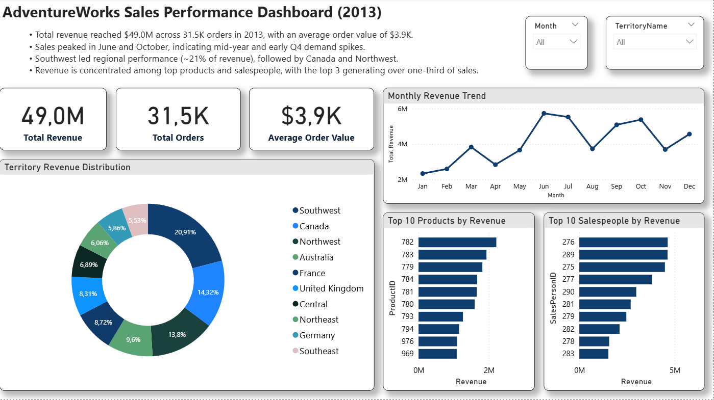

# SQL Sales & HR Analytics – AdventureWorks (2013)

## 📌 Project Overview

This project analyzes **AdventureWorks 2013 sales and workforce data** using **SQL Server and Power BI** to generate business insights.

The analysis focuses on:

- Revenue performance
- Regional sales distribution
- Product revenue concentration
- Salesperson contribution
- Workforce structure and tenure

The objective is to demonstrate the ability to **extract insights from relational data and communicate findings through dashboards and business analysis**.

---

## 🛠 Tools & Technologies

- **SQL Server (T-SQL)**
- **AdventureWorks Database**
- **Power BI**
- **Data Visualization**
- **Business Intelligence**

---

## 📊 Power BI Dashboard

**Dashboard Highlights**

- Monthly revenue trends
- Revenue by sales territory
- Top-performing products
- Salesperson performance comparison
- Interactive territory filtering

---

## 🔑 Key Business Insights

- **Revenue concentration:** Top territories generate a significant share of company revenue.
- **Product dependency:** A small group of products contributes a large portion of total sales.
- **Sales inequality:** Top 3 salespeople generate over **one-third of total revenue**.
- **Seasonality:** Sales peak during **mid-year and early Q4**.
- **Workforce structure:** Over **60% of employees work in production roles**, reflecting an operations-focused organization.

➡️ **Full analysis available here:**  
[View Detailed Insights](insights_summary.md)

---

## 📁 Project Structure
SQL-Sales-HR-Analytics
│
├── sql
│   └── adventureworks_sales_hr_analysis.sql
│
├── dashboard
│   ├── sales_performance_dashboard_2013.pbix
│   └── dashboard_preview.png
│
├── insights
│   └── insights_summary.md
│
└── README.md

---

## 🎯 Skills Demonstrated

- SQL data analysis

- Business insight generation

- Data visualization with Power BI

- Sales performance analysis

- Organizational workforce analysis

- Data storytelling

---

## 📊 Data Source

AdventureWorks2019 Sample Database
A Microsoft sample dataset that simulates a manufacturing and retail business environment.

Key tables used:

Sales:

- Sales.SalesOrderHeader

- Sales.SalesOrderDetail

- Sales.SalesTerritory

- Sales.SalesPerson

Human Resources:

- HumanResources.Employee

- HumanResources.EmployeeDepartmentHistory

- HumanResources.Department